# Readme

 CQU小学期硬件设计


## 调试程序中出现的问题

1. sign_extend模块传入指令应为instrD，即D阶段的指令，错误的将其传为当前指令，导致logic类指令测试出现问题


## 按照类别测试指令结果&说明


#### DataMoveInstTest

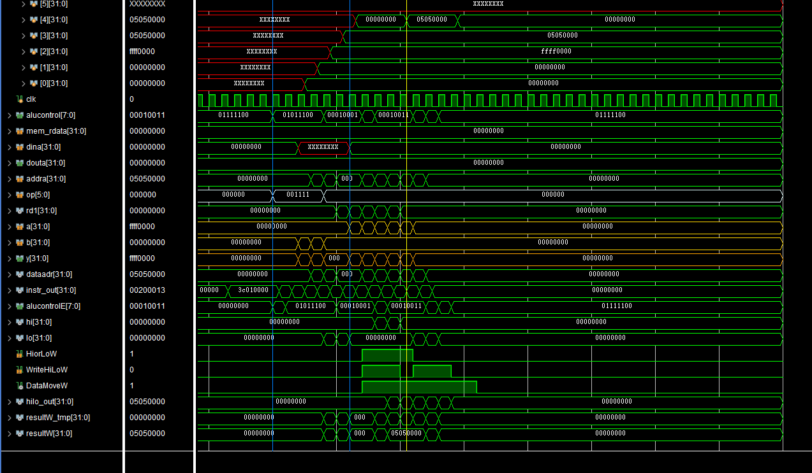

对比inst_rom.S

```R
   .org 0x0
   .set noat
   .global _start
_start:
   lui $1,0x0000          # $1 = 0x00000000 
   lui $2,0xffff          # $2 = 0xffff0000
   lui $3,0x0505          # $3 = 0x05050000
   lui $4,0x0000          # $4 = 0x00000000 

   mthi $0                ## hi = 0x00000000
   mthi $2                ## hi = 0xffff0000
   mthi $3                ## hi = 0x05050000
   mfhi $4                ## $4 = 0x05050000

   mtlo $3                ## lo = 0x05050000
   mtlo $2                ## lo = 0xffff0000
   mtlo $1                ## lo = 0x00000000
   mflo $4                ## $4 = 0x00000000    
```

在第一条蓝竖线处，rst信号变为0，开始执行。仿真波形中橙色的波形为alu的三条线，两个输入数据和一个运算结果数据。
参考下方放大的波形图，首先执行的是四条lui指令，对寄存器进行赋值，可以看到寄存器堆的1，2，3，4号寄存器分别存储了对应的值，接着执行三条mthi，将0，2，3号寄存器内的值赋给hi寄存器。观察橙色信号alu计算结果y的波形，能够与inst_rom中应得的值对应（00000000，ffff0000，05050000）。
接着执行mfhi，将hi中的值存入rd寄存器中，alu对于这条指令不进行处理，直接将y置为00000000，通过resultW传入寄存器。图中resultW在该周期可以与inst_rom对应，观察寄存器内的值也可与之对应，该类指令测试通过。


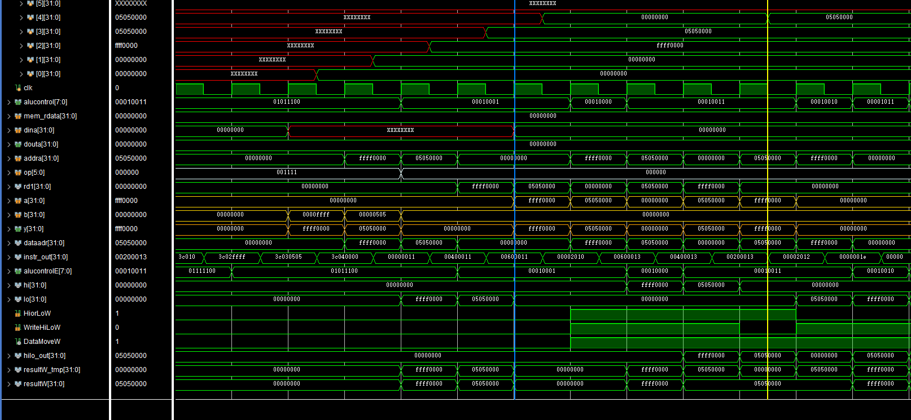


测试J类指令的时候的两个问题：

1.jar指令的时候出错。因为测试文件中已经给出了各个被赋值的寄存器应该是什么值，所以如果当测试文件执行完了，寄存器1的值应该是确定的，所以只需要检查到最后的寄存器1的值。但是仿真的时候发现最后一步是错误的，我们发现在图中红框处，pc的值是一个错误的值，本来应该是00000040，但是现在是00000000。这个原因，我们猜测可能是多路选择器的选择信号接错，也可能是maindecoder对于信号的解析出现了错误。

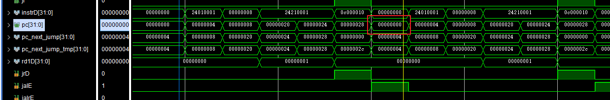

查看maindecoder之后，发现是因为疏漏，解析信号少写了一个，然后因为从低位开始对齐，所以信号就乱掉了。

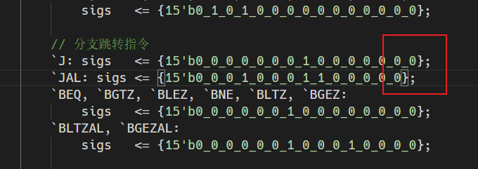


改正之后正确的波形图如下所示，这次的下一个pc应该跳到的是00000040：

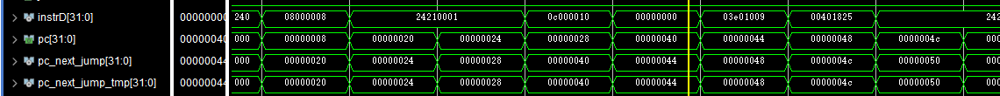


2，本来的设想是对于jal型指令，只需要jal信号为1，其他无关的信号均为0，对于jalr指令也一样，只需要jalr信号为1，其他无关的信号均为0，但是实际上，因为jal指令本来就是jump and link的意思，它所需要的下一个pc的地址也是指令中跳转的地址，如下图，起关键作用的信号为jumpD，在这里，jumpD的信号也应该是1，才能满足指令的要求

这里记得新截一张图，下面的jumpE应该改名为jumpD！！！，还有下面的选择信号jrD应该再或上其他的东西

这个地方的pc值取错了，变成了一个奇怪的值，经过追根溯源之后，发现是多路选择器的选择信号输入少考虑了一种情况。应该或上jarlD信号。

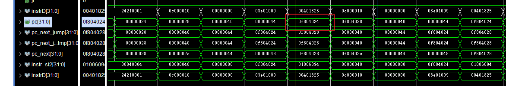


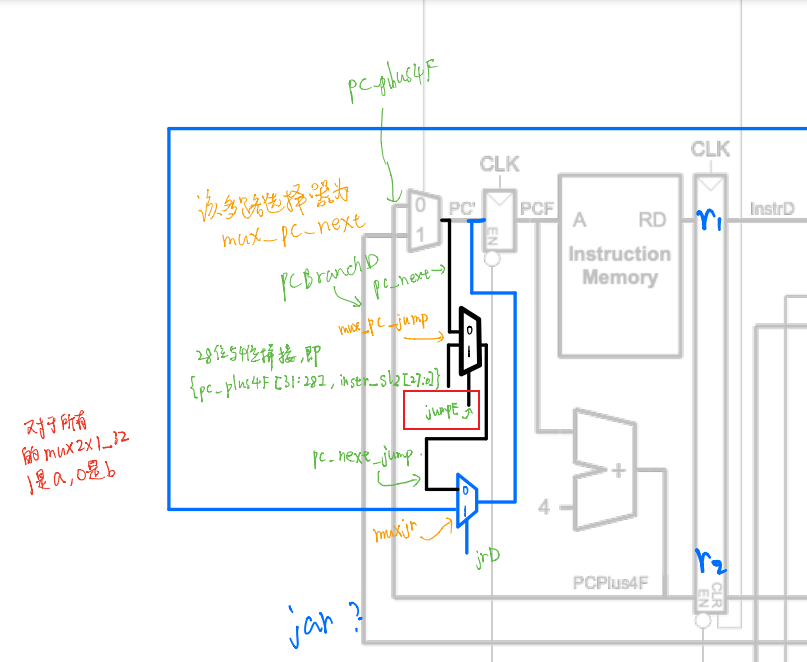


改正之后pc跳转的值变成了正确的0000002c。

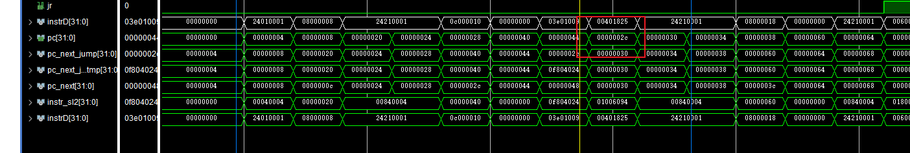

最后可以看出，寄存器堆中的$1到最后存储的值为10，而寄存器\$2与\$3中的值都应该是00000048，证明该项独立测试通过。


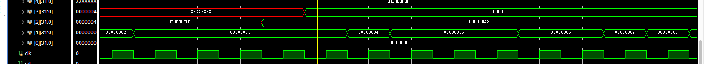


在对于branch指令的测试中，一开始小组成员在将balE信号打印出来之后发现它一直没有变化，于是逐层检查信号来源，发现原因是没有在maindecoder中接入rt信号，导致对于branch and link一类的指令的判断出现了错误。

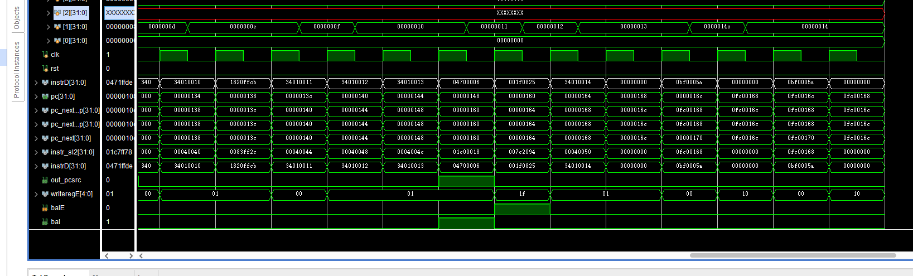

可以看到在上图中，如果顺序执行的话，寄存器\$1的值到倒数第二个周期应该是0x14c，到最后，\$1 的值应该是0x14，因为在测试文件中有着比较复杂的连环跳转，所以检测到最后是这样的输出结果之后，我们可以肯定这些branch类型的指令都是成功执行了的。


3.测试 load-save指令的时候，发现所有的\$3的值都和测试文件中的预期结果是相同的，但是对于\$1，它的值是错误的，在地址为0x0020的指令处会读\$1 ，但是读的值是错误的，所以这个时候应该检查前面的存进去的掩码部分，可能是小组成员对于掩码部分的理解出现问题，导致在前面的指令中存入\$3的值出现错误。

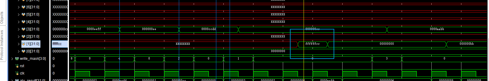